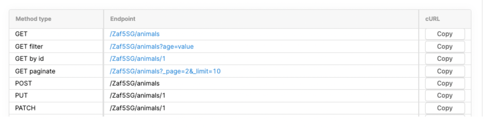

# Animals - API testing
Test Automation coding challenge :muscle:

**URL** : https://retoolapi.dev/Zaf5SG/animals
## Pre-requirements
- **Package manager:** Meaven 3.9.6
- **Language:**  Java 8
- **Test framework:** Junit 4.13.2
- **Test library:** RestAssured 5.4.0

## Dependencies
All project dependencies are stored in <b>pom.xml</b> file

## How to run tests: 
### Install dependencies:
#### Build docker image from project root path:
```bash
mvn clean install
```
During image build, all packages and dependencies are installed as well.

# Exercise:

1. Write automated API tests in which you will add a new animal.

Write an invalid API test in which you will get an error.
Write assertions for them.
Please include a README.md file.
Publish your solution on your private GitHub/GitLab/BitBucket repositoryentation/v2 

Available methods:
